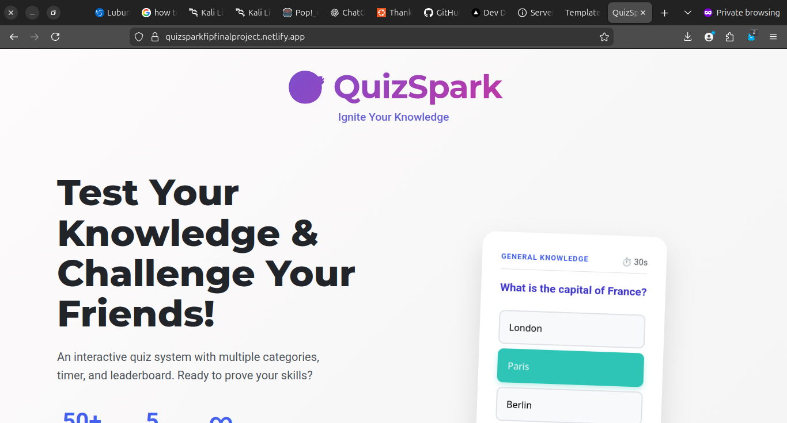

# QuizSpark - Student Quiz System 🎯

## 🚀 Live Demo
[View Live Project](https://quizsparkfipfinalproject.netlify.app)

<div align="center">
  
</div>

## 📋 Project Overview
QuizSpark is an interactive quiz web application designed for students to practice self-assessment through multiple-choice questions. The app mimics Distinction's gamified quiz approach, reinforcing logic building and event-driven programming.

### 🎯 **Project Goal**
Create a dynamic quiz web app that tests user knowledge through multiple-choice questions and displays results with feedback.

### 👥 **Target Audience**
- Students practicing self-assessment quizzes
- Learners preparing for exams
- Anyone looking to test their knowledge in various subjects

## ✨ **Features**

### ✅ **Core Features**
- **Multiple-choice question display** with beautiful card layout
- **Score tracker** with real-time updates
- **Timer functionality** (optional per question)
- **Leaderboard** using LocalStorage
- **Progress bar** showing quiz completion
- **Final results modal** with detailed feedback
- **Responsive design** for desktop and mobile
- **Three color themes** from specified palettes

### 🎮 **Advanced Features**
- **Category selection** (5 categories)
- **Difficulty levels** (Easy, Medium, Hard)
- **Question randomization**
- **Instant feedback** with explanations
- **Quiz history** and personal statistics
- **Achievement badges**
- **Text-to-speech** functionality
- **Export data** capability
- **Keyboard shortcuts** for better UX

## 🎨 **Color Palette Used**
**Palette 1: Professional Theme**
- Primary: `#8ECAE6` (Light Blue)
- Secondary: `#219EBC` (Blue)
- Dark: `#023047` (Dark Blue)
- Accent 1: `#FFB703` (Yellow)
- Accent 2: `#FB8500` (Orange)

*Using 2 colors as required: #8ECAE6 and #219EBC*

## 🛠 **Technologies Used**

### Frontend
- **HTML5** - Semantic markup
- **CSS3** - Custom properties, Grid, Flexbox, Animations
- **JavaScript (ES6+)** - Vanilla JS with OOP principles

### APIs & Storage
- **Web Storage API** - Leaderboard persistence
- **Web Speech API** - Text-to-speech functionality
- **Clipboard API** - Copy to clipboard

### Tools & Methodologies
- **Mobile-First Design** - Responsive approach
- **CSS Variables** - Theme switching
- **Modular JavaScript** - Clean code architecture
- **Git & GitHub** - Version control
- **GitHub Pages** - Free hosting

## 📁 **Project Structure**

## Project Structure

```
QuizSparkFIPFinalProject/
├── index.html # Home page
├── quiz.html # Quiz interface
├── leaderboard.html # Leaderboard page
├── css/
│ ├── style.css # Main styles
│ └── quiz.css # Quiz-specific styles
├── js/
│ ├── main.js # Home page logic
│ ├── quiz.js # Quiz logic
│ ├── leaderboard.js # Leaderboard logic
│ └── utils.js # Utility functions
├── data/
│ └── questions.json # Quiz questions database
├── assets/
│ └── screenshots/ # Project screenshots
├── docs/
│ ├── documentation.pdf # Project documentation
│ └── presentation.pdf # Presentation slides
└── README.md # This file
```


## 📸 **User Interface Tour**

Explore the application flow from login to leaderboard.

<div align="center">
  
  
  
  
  
  
  
  
  
  
  
  
  
</div>


## 🎯 **Learning Outcomes Demonstrated**

### Technical Skills
1. **DOM Manipulation** - Dynamic content updates
2. **Event Handling** - User interactions and feedback
3. **Local Storage** - Data persistence for leaderboard
4. **CSS Grid & Flexbox** - Responsive layouts
5. **JavaScript Classes** - Object-oriented programming
6. **Async Programming** - Timers and animations
7. **API Integration** - Web Speech and Clipboard APIs
8. **Error Handling** - Graceful error recovery
9. **Performance Optimization** - Efficient rendering

### Soft Skills
1. **Problem Solving** - Algorithm design for scoring
2. **UX/UI Design** - Intuitive user interface
3. **Project Planning** - Feature implementation roadmap
4. **Documentation** - Clear code comments and README
5. **Presentation** - Project demonstration skills

## 🚀 **Setup & Installation**

### Local Development
1. **Clone the repository**
   ```bash
   git clone https://github.com/ShuaibuPassionateProgrammer/QuizSparkFIPFinalProject.git
   cd QuizSparkFIPFinalProject